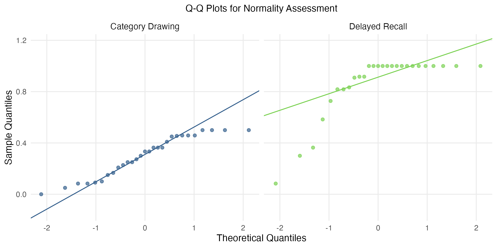
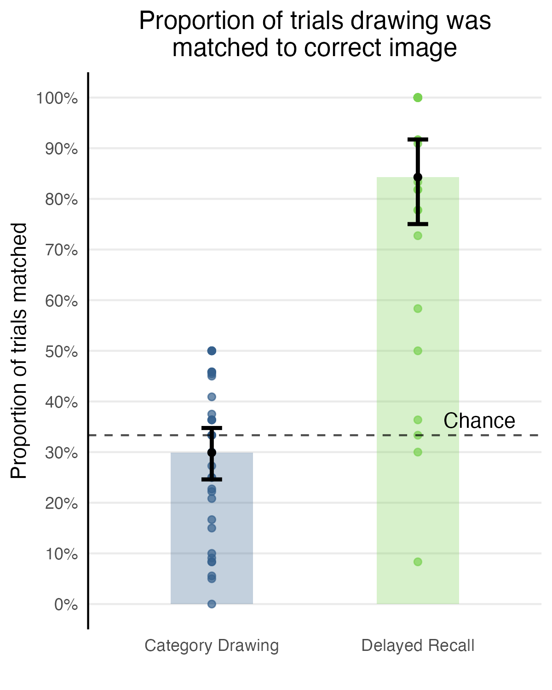

## Introduction

Understanding the diagnosticity of visual scenes and the relationship between visual saliency and memory represents a key area of cognitive research with important applications in developmental psychology. Bainbridge et al. (2019) established a methodologically robust paradigm demonstrating that delayed recall drawings contain image-specific visual information beyond categorical representations. Replicating this core finding is essential to establish the reliability of the drawing-to-picture matching paradigm before extending it to investigate developmental differences in visual recall and the role of visual saliency in memory diagnosticity. The current replication focuses specifically on the contrast between delayed recall and category drawings, which provides the strongest theoretical test of whether memory representations preserve image-specific visual details.

We selected 17 scene categories appropriate for potential developmental extensions, using both high-memorable and low-memorable exemplars to preserve the original memorability manipulation. Our key hypothesis is that Delayed Recall drawings will be matched to their target images significantly more accurately than Category Drawings, replicating the original finding with a modern online implementation.

::: {.callout-note}
### Links

[Project repository](https://github.com/haoyudu/bainbridge2019)

Original paper: Bainbridge, W.A., Hall, E.H. & Baker, C.I. [Drawings of real-world scenes during free recall reveal detailed object and spatial information in memory.](https://github.com/haoyudu/bainbridge2019/blob/main/original_paper/bainbridge2019.pdf) Nat Commun 10, 5 (2019). 

[Experimental paradigm](https://github.com/psyc-201/bainbridge2019/blob/main/experiment/index.html)

[Preregistration](https://osf.io/q8fnd/overview)
::: 


## Methods

### Power Analysis

In the original study, Delayed Recall drawings were correctly matched to their corresponding images by 84.3\% of raters (SD = 10.9\%), significantly outperforming Category Drawings at 30.7\% (SD = 17.4\%), yielding a very large effect size (Cohen's d = 3.7). Given this robust effect, we conducted an *a priori* conservative power analysis for an independent samples t-test (two-tailed) assuming a substantially attenuated effect size of d = 2.0, alpha  = 0.05, and 90\% power, which indicated that only 7 drawings per condition (14 total) would be required to detect the effect with 90\% power. 

To maintain fidelity to the original study's design and enable exploratory analyses by category and memorability, we will rate 34 Delayed Recall drawings and 34 Category Drawings (68 total) from 17 selected scene categories. Specifically, both image exemplars per category (one high-memorable and one low-memorable) will be included, preserving the original memorability manipulation and allowing for some within-category comparisons. With this sample size, the study achieves greater than 99\% power to detect an effect of d = 2.0, and remains well-powered even if the true effect size is as small as d = 1.0. Additionally, while the original study employed 24 independent raters per drawing, we will use 10-12 per drawing to balance cost efficiency with measurement reliability. Given the high accuracy and inter-rater reliability in the original study (inferred from proportion correct), 10-12 raters should provide stable estimates of drawing recognizability.


### Planned Sample

Approximately 12 participants will be recruited via [Prolific](www.prolific.com) to complete the drawing-to-picture matching task. Eligibility criteria include fluent English speakers, age 18 years or older, normal or corrected-to-normal vision. Ideally, participants would have no prior exposure to the Bainbridge et al. (2019) stimulus set; however, Prolific does not provide automatic screening for this criterion across different researchers. Each participant will complete 60 trials, matching the original study's average of 58.2 trials per participant. With 68 drawings requiring 10 ratings each, this yields 680 total trials distributed across 12 participants (60 trials per participant times 12 participants equals 720 possible ratings, accounting for minor variation in completion rates and attention checks).

Data collection will continue until all 68 drawings have received at least 10 complete ratings from unique participants who pass quality control checks (detailed below). If initial recruitment yields fewer than 10 usable ratings per drawing, additional participants will be recruited in batches of 2-3 until the target is reached. Participants will be paid \$2.5 for approximately 12 minutes of work (\$12 per hour).

### Materials

The stimuli consist of real-world scene photographs from the SUN database (Xiao et al., 2010). From the original 30 scene categories, we selected 17 categories appropriate for potential developmental extensions: amusement park, badlands, bathroom, bedroom, dining room, farm, fountain, garden, house, kitchen, lighthouse, living room, mountain, playground, pool, street, tower. For each category, there are two image exemplars (one high-memorable and one low-memorable based on prior memorability scores from Isola et al., 2011) and one medium-memorable foil image. This gives us 34 target images (2 per category times 17 categories) and 17 foil images (1 per category). All images are 512 pixels on the longest dimension and approximately 14 degrees of visual angle when viewed on a standard monitor at typical viewing distance. 

The drawings are from the publicly available dataset associated with Bainbridge et al. (2019), accessed via [Harvard Dataverse](https://dataverse.harvard.edu/dataverse/drawingrecall). Two types of drawings will be used as stimuli for this replication experiment. First, Delayed Recall drawings (n = 34) were created by participants who studied 30 scene images for 10 seconds each, completed an 11-minute digit span distractor task, and then drew as many images as they could remember from memory. For each of the 34 target images in the selected categories, one Delayed Recall drawing will be selected from the available drawings for that image. When multiple drawings are available for an image, one will be randomly selected using R's `sample()` function to reduce researcher bias in drawing selection. Second, Category Drawings (n = 34) were created by participants who were given only the scene category name (e.g., "kitchen") and asked to draw a typical example of that category without viewing any specific image. Two Category Drawings per selected category will be randomly sampled from the 15 available Category Drawings per category in the original dataset. 

All drawings are pen-and-paper sketches and scanned as JPG files. Filenames in the original dataset follow the format `[condition]_[subnum]_[imnum]_[memorability]_[scene].jpg`, enabling identification of which target image corresponds to each drawing.

### Procedure	

The experimental task is programmed using the jsPsych library (de Leeuw, 2015) and hosted via GitHub Pages. Data is collected using the DataPipe plugin and stored directly to the project's Open Science Framework (OSF) repository (see links). Participants access the experiment through Prolific's participant recruitment platform. 

The task design closely follows the original study's "Drawing matching online experiment" (Bainbridge et al., 2019), adapted from single-trial Amazon Mechanical Turk HITs to a multi-trial jsPsych session. Participants will first read instructions explaining that they will see drawings of everyday scenes and their task is to match each drawing to one of three photographs. On each trial, they will see one drawing and three photographs from the same scene category (e.g., three different kitchens), and should select which photograph they think the drawing best represents. Participants will be told that even if the drawing is rough or incomplete, they should try their best to make a match. The instructions note that the task will take approximately 12 minutes and request that the participants complete it in a quiet environment without distractions on a desktop or laptop computer (mobile devices will be excluded). Participants will remain naive to the experimental manipulation.  

Each trial follows the structure of the original experiment. The drawing is displayed centered at the top of the screen, with three scene photographs presented in a horizontal row below. Following the original implementation, the spatial positions (left, center, right) of the three photographs are randomized on each trial using a shuffle algorithm. Participants select their response by clicking on one of the three photographs. After making a selection, participants click a "Continue" button to proceed to the next trial. 

There is no time limit for responses, allowing participants to carefully consider their choices as in the original study. However, to ensure active engagement and data quality, the entire experimental session has a thirty minute time limit. Participants who do not complete all 60 trials within this window will be excluded from analysis. This session-level timeout is consistent with standard Amazon Mechanical Turk practices (though not explicitly reported in the original study) and is generous given the expected completion time of approximately 12 minutes.

Each participant completes 60 trials in random order. Trials are sampled such that each drawing appears at most once per participant, and drawings from both conditions are intermixed. Participants remain blind to the drawing condition. For each Delayed Recall drawing, the target image is predetermined. For each Category Drawing, there is no predetermined target, as these drawings were created from category names rather than specific images. The two foil images for each trial are the other two images from the same category. The presentation order of all 60 trials is randomized uniquely for each participant.

To ensure data quality, three attention check trials are inserted at random positions within the 60-trial sequence. On these trials, participants see a clear, unambiguous instruction (e.g., "Please select the leftmost image to show you are paying attention") or a simple drawing that makes the correct answer obvious. Participants who fail 2 or more attention checks will be flagged for exclusion from analysis. 

After completing all trials, participants will answer two brief questions. First, "Did you experience any technical difficulties during the task?" with Yes/No response options and an optional text explanation. Second, "Do you have any comments about the study?" with an optional text response field. Participants are then thanked, debriefed, provided with a completion code for Prolific verification, and redirected to Prolific for compensation. 

For each trial, the following data will be recorded and saved: (1) participant identification number (anonymized Prolific ID), (2) trial number, (3) drawing filename, (4) drawing condition (Delayed Recall or Category), (5) target image filename (for Delayed Recall drawings) or null (for Category Drawings), (6) the three image filenames in their randomized positions (left, center, right), (7) the participant's selected image, (8) response time in milliseconds, and (9) whether the trial is an attention check, (10) for Category Drawings: which image was selected (high-memorable, low-memorable, or foil). At the end of the session, participant-level data including responses to the technical difficulties question, open-ended comments, total session duration, and completion status will also be recorded. This data structure enables computation of trial-level accuracy (correct vs. incorrect selection), drawing-level accuracy (proportion correct across raters), and application of all exclusion criteria specified in the Analysis Plan. All data will be saved in JSON format and automatically uploaded to the linked OSF repository upon completion of each participant's session.

### Analysis Plan

**Data cleaning and exclusion criteria:**

At the participant level, we exclude participants who meet any of the following criteria. First, participants who incorrectly respond to 2 or more of the 3 attention check trials are excluded entirely. Second, participants who do not complete all 60 experimental trials within the 30-minute session limit are excluded. Third, participants who self-report significant technical problems (e.g., images not loading properly) are reviewed on a case-by-case basis and excluded if issues likely impaired task performance. Fourth, participants whose median response time across all experimental trials is below 1 second, indicating rapid clicking without consideration or whose overall accuracy on delayed recall trials is below chance (33.3\%) are excluded as evidence of non-compliance.

At the trial level, individual trials with response times less than 1200ms (1000ms delay before button enabled) are excluded as anticipatory responses that do not reflect genuine matching judgments. After applying this trial-level exclusion, if more than 20\% of the participant's trials are excluded, the entire participant is excluded from analysis as their data is insufficiently reliable.

In the final participant sample, no participants were excluded. 

**Data preparation and unit of analysis:**

The primary unit of analysis is the drawing, with accuracy computed as the proportion of raters who correctly matched each drawing to its target image. Data preparation proceeds in three stages. First, at the trial level, accuracy is a binary-coded variable where 1 indicates the participant correctly selected the target image and 0 indicates the selection of a foil image. Second, at the drawing level, we compute the proportion of raters who correctly identified the target image using the formula `(number of correct responses) / (total number of valid ratings for this drawing)`. Each of the 68 drawings yields one accuracy score ranging from 0 to 1, aggregated across 8-12 independent raters after applying all exclusion criteria. Third, each drawing is labeled as either "Delayed Recall" or "Category" based on the dataset.

For Delayed Recall drawings, accuracy at the trial level is straightforward: 1 if the participant selected the target image, 0 otherwise. For Category Drawings, since there is no single correct target image, trial-level responses are coded as selection of the high-memorable exemplar, low-memorable exemplar, or foil. At the drawing level, accuracy for Category Drawings is computed following the original study's approach: for each Category Drawing, we calculate the proportion of raters who selected the high-memorable exemplar and separately the proportion who selected the low-memorable exemplar, then average these two proportions. This yields a hypothetical accuracy score that represents the average match rate if either exemplar were considered the target.

**Confirmatory analysis:**

The key hypothesis is that Delayed Recall drawings will be matched to their target images significantly more accurately than Category Drawings, replicating the original finding. Following Bainbridge et al. (2019), this is tested using a two-tailed Wilcoxon rank-sum test comparing the distribution of accuracy scores between the two drawing conditions. The null hypothesis states that the distributions of matching accuracy are identical between Delayed Recall and Category Drawing conditions. The alternative hypothesis states that the distributions differ between conditions. The significance level is set at alpha = 0.05 (two-tailed). Effect size is quantified using rank-biserial correlation, where values of 0.1, 0.3, and 0.5 conventionally correspond to small, medium, and large effects.

The rationale for using a non-parametric test is to adhere to the original study. The authors noted that accuracy proportions, bounded between 0 and 1, may not follow normal distributions, particularly when values cluster near boundaries. The Wilcoxon test makes no distributional assumptions about the shape of the data and is therefore more appropriate for proportions. Additionally, this choice ensures direct comparability with the original statistical approach.

As a sensitivity analysis to assess robustness of findings, we also report results from a two-tailed independent samples t-test with Cohen's d as the effect size metric. If assumptions are violated, Welch's correction is applied. Specifically, we assess normality using Shapiro-Wilk tests on both groups' accuracy distributions plus visual inspection via quantile-quantile plots. We also assess the homogeneity of variance using Levene's test, and if violated, we use Welch's t-test instead of Student's t-test. If both the Wilcoxon test and t-test converge on the same conclusion regarding significance and direction, this strengthens confidence in the finding. However, if normality is strongly violated (p < 0.01 in Shapiro-Wilk tests for either group), the Wilcoxon test is prioritized as the primary analysis.

**Criteria for successful replication:**

The replication is considered successful given the following two conditions. First, the Wilcoxon rank-sum test shows that Delayed Recalled drawings have significantly higher matching accuracy than Category Drawings (p < 0.05, two-tailed). Second, the effect size should at least be medium magnitude (rank-biserial r > 0.3), though we anticipate a much larger effect given the original study's Z-score of 9.29 and p-value of 1.58e-20. A close replication would show Delayed Recall accuracy substantially above chance (original: 84.3\%), Category Drawing accuracy near chance (original: 30.7\%), and a very large effect size.

### Differences from Original Study

Several aspects of the current replication differ from Bainbridge et al. (2019), though none are expected to fundamentally alter the main effect given its robustness in the original study.

First, the original study used all 60 images from 30 scene categories, whereas the current replication uses 34 images from 17 categories selected for child-appropriateness to enable potential developmental extensions. This may reduce generalizability across scene types but should not affect the core theoretical contrast if the effect is robust across the included categories. The 17 selected categories span indoor (e.g., bedroom, kitchen), outdoor natural (e.g., badlands, farm), and outdoor man-made (e.g., tower, fountain) scenes, maintaining diversity in scene types.

Second, the original study used 24 independent raters per drawing, whereas the current replication uses 8-12 raters per drawing across 12 total participants. This reduction is justified by the high inter-rater reliability evident in the original results and power analyses indicating that 8-12 raters should provide stable estimates of drawing recognizability.

Third, the original study recruited participants from Amazon Mechanical Turk, whereas the current replication uses Prolific. Both platforms recruit general adult populations from primarily the United States.

Fourth, the original study analyzed all Delayed Recall drawings produced by 30 participants (approximately 363 total) and all 15 Category Drawings per category (450 total). The current replication selects one Delayed Recall drawing per target image and 2 Category Drawings per category (34 total each condition). This design choice ensures balanced sample sizes and simplifies statistical analysis by treating drawings as independent observations, though it reduces representation of within-image drawing variability.

Finally, the current replication implements explicit exclusion criteria and session-level timeouts to ensure data quality in an online platform without introducing researcher degrees of freedom during post-hoc exclusions.

Despite these differences, the fundamental experimental design, task structure, and theoretical question remain unchanged. The original effect was extremely large, and the theoretical prediction that memory drawings contain image-specific visual information beyond category-level representations should hold robustly across these methodological variations. The modifications primarily serve to adapt the study from AMT's single-trial framework to a modern multi-trial jsPsych implementation while improving experimental control and reproducibility practices.

### Reliability and Validity

The primary construct of interest is drawing recognizability, operationalized as the proportion of independent raters who correctly match each drawing to its corresponding image in a 3AFC task. The measure ranges from 0 to 1, with chance performance at 1/3. The original study used 24 independent raters per drawing to assess recognizability, which provides a form of inter-rater reliability through aggregation across multiple judges. The relatively small standard deviations reported for both conditions suggest agreement among raters. Construct validity is also established through multiple control conditions, such as having Image Drawings and Immediate Recall in addition to Category Drawings. The task also has strong face validity, as matching drawings to photographs is a direct and intuitive assessment of visual information content. Even with a slightly different sample, the replication will assume the validity of the measure and ensure reliability with multiple raters per image. 

#### Actual Sample
```{r participant-exclusions}
#| echo: true
#| message: false
#| warning: false
library(tidyverse)
exclusion_data <- read.csv("output/participant_exclusions_full_sample.csv")

# treat NA technical difficulties as FALSE (no technical problems)
exclusion_data$exclude_technical[is.na(exclusion_data$exclude_technical)] <- FALSE
exclusion_data$exclude_any <- exclusion_data$exclude_attention | 
                              exclusion_data$exclude_incomplete | 
                              exclusion_data$exclude_timeout | 
                              exclusion_data$exclude_fast_rt | 
                              exclusion_data$exclude_low_accuracy | 
                              exclusion_data$exclude_technical

# summary statistics
total_recruited <- nrow(exclusion_data)
total_excluded <- sum(exclusion_data$exclude_any)
total_retained <- total_recruited - total_excluded

# exclusion reasons
n_exclude_attention <- sum(exclusion_data$exclude_attention)
n_exclude_incomplete <- sum(exclusion_data$exclude_incomplete) 
n_exclude_timeout <- sum(exclusion_data$exclude_timeout)
n_exclude_fast_rt <- sum(exclusion_data$exclude_fast_rt)
n_exclude_low_accuracy <- sum(exclusion_data$exclude_low_accuracy)
n_exclude_technical <- sum(exclusion_data$exclude_technical)

# retained participants
retained_data <- exclusion_data %>% filter(!exclude_any)
mean_session_duration <- mean(retained_data$session_duration_min)
mean_median_rt <- mean(retained_data$median_rt)

trial_data <- read.csv("output/clean_trial_data_full_sample.csv")
ratings_per_drawing <- trial_data %>%
  group_by(drawing_filename, condition) %>%
  summarise(n_ratings = n(), .groups = 'drop') %>%
  arrange(n_ratings)

min_ratings <- min(ratings_per_drawing$n_ratings)
max_ratings <- max(ratings_per_drawing$n_ratings)
mean_ratings <- mean(ratings_per_drawing$n_ratings)
total_participants <- length(unique(trial_data$participant_id))
total_drawings <- nrow(ratings_per_drawing)
n_drawings_below_target <- sum(ratings_per_drawing$n_ratings < 10)

# count by condition for those below target
below_target_by_condition <- ratings_per_drawing %>%
  filter(n_ratings < 10) %>%
  count(condition)

n_delayed_below <- below_target_by_condition$n[below_target_by_condition$condition == "delayed_recall"]
n_category_below <- below_target_by_condition$n[below_target_by_condition$condition == "category"]

# one condition has no drawings below target
if(length(n_delayed_below) == 0) n_delayed_below <- 0
if(length(n_category_below) == 0) n_category_below <- 0
```

Pilot B included 6 participants recruited via Prolific. No participants were excluded based on the preregistered criteria: all completed 60 trials, passed attention checks, reported no technical difficulties, and showed adequate response times and compliance. All 360 trials were retained after applying the 1200 ms RT threshold. Based on these promising pilot results, full data collection proceeded with the same protocol and exclusion criteria.

**Full Sample:** A total of `r total_recruited` participants were recruited via Prolific. Of these, `r total_excluded` participants were excluded. The final sample included `r total_retained` participants who completed an average of `r round(mean_session_duration, 1)` minutes per session, with median response times of `r round(mean_median_rt, 0)` ms. This resulted in `r round(mean_ratings, 1)` ratings per drawing on average (range: `r min_ratings`-`r max_ratings`), with `r n_drawings_below_target` drawings receiving fewer than the target 10 ratings (`r n_delayed_below` delayed recall, `r n_category_below` category drawings). 

#### Differences from pre-data collection methods plan
None.


## Results

### Data preparation
```{r data-prep}
#| echo: true
#| message: false
#| warning: false

library(tidyverse)
trial_data <- read.csv("output/clean_trial_data_full_sample.csv")

# drawing-level accuracy
drawing_accuracy <- trial_data %>%
  group_by(drawing_filename, condition) %>%
  summarise(
    n_raters = n(),
    # for delayed recall, standard accuracy (correct/total), and for category, avg of high and low selection rates
    accuracy = if_else(
      condition[1] == "delayed_recall",
      sum(correct, na.rm = TRUE) / n(),
      (sum(selected_type == "high", na.rm = TRUE) + sum(selected_type == "low", na.rm = TRUE)) / (2 * n())
    ),
    # raw counts
    n_correct_delayed = ifelse(condition[1] == "delayed_recall", sum(correct, na.rm = TRUE), NA),
    n_high_selected = sum(selected_type == "high", na.rm = TRUE),
    n_low_selected = sum(selected_type == "low", na.rm = TRUE),
    n_foil_selected = sum(selected_type == "foil", na.rm = TRUE),
    .groups = 'drop'
  ) %>%
  # additional variables for analysis
  mutate(
    category = str_extract(drawing_filename, "(?<=_)[a-z]+(?=\\.jpg)"),
    memorability = case_when(
      str_detect(drawing_filename, "_high_") ~ "high",
      str_detect(drawing_filename, "_low_") ~ "low", 
      TRUE ~ NA_character_
    )
  )

drawing_accuracy %>%
  group_by(condition) %>%
  summarise(
    n_drawings = n(),
    mean_accuracy = mean(accuracy),
    min_accuracy = min(accuracy),
    max_accuracy = max(accuracy)
  )

# dataset with adequate sample size (>=10 raters)
drawing_accuracy_adequate <- drawing_accuracy %>%
  filter(n_raters >= 10)

# summary stats
desc_stats_adequate <- drawing_accuracy_adequate %>%
  group_by(condition) %>%
  summarise(
    n_drawings = n(),
    mean_accuracy = mean(accuracy),
    sd_accuracy = sd(accuracy),
    median_accuracy = median(accuracy),
    min_accuracy = min(accuracy),
    max_accuracy = max(accuracy),
    .groups = 'drop'
  )
```

The final dataset contains `r nrow(drawing_accuracy_adequate)` drawings with the following variables: drawing filename, condition (Delayed Recall or Category), category, memorability (high or low), number of raters, number correct, and accuracy (proportion correct). Delayed Recall drawings achieved a mean accuracy of `r round(desc_stats_adequate$mean_accuracy[desc_stats_adequate$condition == "delayed_recall"], 3)` (SD = `r round(desc_stats_adequate$sd_accuracy[desc_stats_adequate$condition == "delayed_recall"], 3)`), meaning Delayed Recall drawings were correctly matched to their original images from among same category foils by `r round(desc_stats_adequate$mean_accuracy[desc_stats_adequate$condition == "delayed_recall"], 3)*100`\% of Prolific workers on average. Category Drawings achieved `r round(desc_stats_adequate$mean_accuracy[desc_stats_adequate$condition == "category"], 3)` (SD = `r round(desc_stats_adequate$sd_accuracy[desc_stats_adequate$condition == "category"], 3)`), meaning they were on average matched near chance. 

### Primary confirmatory analysis

```{r primary-results-plots}
#| echo: true
#| message: false
#| warning: false

library(effectsize)
library(car)  # for levene's test

delayed_accuracy <- drawing_accuracy_adequate %>%
  filter(condition == "delayed_recall") %>%
  pull(accuracy)

category_accuracy <- drawing_accuracy_adequate %>%  
  filter(condition == "category") %>%
  pull(accuracy)

# Wilcoxon rank-sum test
wilcox_result <- wilcox.test(delayed_accuracy, category_accuracy, alternative = "two.sided")

# rank-biserial correlation using effectsize
rank_biserial_result <- rank_biserial(delayed_accuracy, category_accuracy)
rank_biserial <- rank_biserial_result$r_rank_biserial

# assumption checks
shapiro_delayed <- shapiro.test(delayed_accuracy)
shapiro_category <- shapiro.test(category_accuracy)
levene_result <- leveneTest(accuracy ~ condition, data = drawing_accuracy_adequate)

# sensitivity analysis: t-test
t_result <- t.test(accuracy ~ condition, data = drawing_accuracy_adequate, 
                   alternative = "two.sided", var.equal = FALSE)
# z stat
z_stat <- qnorm(wilcox_result$p.value/2, lower.tail = FALSE) * 
          sign(median(delayed_accuracy) - median(category_accuracy))

# Cohen's d
n_delayed <- length(delayed_accuracy)
n_category <- length(category_accuracy)
pooled_sd <- sqrt(((n_delayed - 1) * var(delayed_accuracy) + 
                   (n_category - 1) * var(category_accuracy)) / 
                  (n_delayed + n_category - 2))
cohens_d <- (mean(delayed_accuracy) - mean(category_accuracy)) / pooled_sd
```

```{r fig.width=4, fig.height=5}
#| echo: true
#| message: false
#| warning: false
library(scales)
plot_data_qc <- drawing_accuracy_adequate %>%
  mutate(Condition = ifelse(condition == "delayed_recall", "Delayed Recall", "Category Drawing")) %>%
  mutate(Condition = factor(Condition, levels = c("Category Drawing", "Delayed Recall")))

replication_plot <- ggplot(plot_data_qc, aes(x = Condition, y = accuracy)) +
  geom_point(aes(color = Condition), size = 1.5, alpha = 0.7) + 
  stat_summary(fun = mean, geom = "col", alpha = 0.3, 
               aes(fill = Condition), width = 0.4, show.legend = FALSE) +
  stat_summary(fun.data = mean_cl_boot, geom = "errorbar", 
               width = 0.1, size = 1, color = "black") +
  stat_summary(fun = mean, geom = "point", size = 2.5,
               color = "black", shape = 19) +
  geom_hline(yintercept = 1/3, linetype = "dashed", alpha = 0.7, color = "black") +
  annotate("text", x = 2.3, y = 1/3, label = "Chance", vjust = -0.5, size = 3) +
  
  scale_y_continuous(limits = c(0, 1), labels = percent_format(),
                     breaks = seq(0, 1, 0.1)) +
  scale_color_viridis_d(begin = 0.3, end = 0.8, name = "") +
  scale_fill_viridis_d(begin = 0.3, end = 0.8, name = "") +
  labs(title = "Proportion of trials drawing was\nmatched to correct image",
       y = "Proportion of trials matched", 
       x = "") +
  theme_minimal() +
  theme(
    legend.position = "none",
    panel.grid.minor = element_blank(),
    panel.grid.major.x = element_blank(),
    axis.text.x = element_text(size = 10), 
    plot.title = element_text(hjust = 0.5, size = 11),
    panel.border = element_blank(),
    axis.line.y = element_line(color = "black")
  )

ggsave("output/results/replication_plot_qc.png", plot = replication_plot, width = 4, height = 5, dpi = 300)

```

The primary hypothesis was tested using a two-tailed Wilcoxon rank-sum test comparing accuracy distributions between Delayed Recall and Category drawings. Note that Bainbridge et al. (2019) applied Bonferroni correction because they conducted multiple pairwise comparisons across four experimental conditions. Since our replication focuses on the single theoretically critical comparison between Delayed Recall and Category Drawing conditions, no multiple comparison correction is needed (alpha = 0.05 as preregistered). 

```{r, fig.show="hold", out.width="50%", fig.cap=c("Current Replication Results", "Original Results (Bainbridge et al., 2019)"), fig.align="center"}
knitr::include_graphics(c("output/results/replication_plot_qc.png","output/results/original_plot.png"))
```

**Delayed Recall drawings (Median = `r round(median(delayed_accuracy), 3)`) were significantly more recognizable than Category Drawings (Median = `r round(median(category_accuracy), 3)`), W = `r wilcox_result$statistic`, Z = `r round(z_stat, 2)`, p = `r format.pval(wilcox_result$p.value, digits = 3)`, rank-biserial r = `r round(rank_biserial, 3)`.**


```{r q-q-normality}
# Q-Q plots for normality assessment
qq_data <- data.frame(
  accuracy = c(delayed_accuracy, category_accuracy),
  condition = c(rep("Delayed Recall", length(delayed_accuracy)),
                rep("Category Drawing", length(category_accuracy)))
)

qq_plots <- ggplot(qq_data, aes(sample = accuracy)) +
  stat_qq(aes(color = condition), alpha = 0.7) +
  stat_qq_line(aes(color = condition)) +
  facet_wrap(~ condition) +
  scale_color_viridis_d(begin = 0.3, end = 0.8) +
  labs(title = "Q-Q Plots for Normality Assessment",
       x = "Theoretical Quantiles",
       y = "Sample Quantiles") +
  theme_minimal() +
  theme(
    legend.position = "none",
    panel.grid.minor = element_blank(),
    strip.text = element_text(size = 10),
    plot.title = element_text(hjust = 0.5, size = 11)
  )

ggsave("output/results/qq_plots.png", plot = qq_plots, width = 8, height = 4, dpi = 300)

```

To check our assumptions, we applied Shapiro-Wilk tests which indicated both conditions violated normality assumptions (Delayed Recall: W = `r round(shapiro_delayed$statistic, 3)`, p = `r format.pval(shapiro_delayed$p.value, digits = 3)`; Category: W = `r round(shapiro_category$statistic, 3)`, p = `r format.pval(shapiro_category$p.value, digits = 3)`). Visual inspection of Q-Q plots confirming these departures, with the Delayed Recall condition showing particularly severe deviations due to a ceiling effect. Levene's test indicated homogeneity of variance was satisfied (F = `r round(levene_result$'F value'[1], 2)`, p = `r format.pval(levene_result$'Pr(>F)'[1], digits = 3)`). Since normality was strongly violated for the Delayed Recall condition (p < 0.01), the Wilcoxon test was prioritized as the primary analysis following our preregistered decision rule. For the sensitivity analysis, we applied Welch's t-test due to the normality violations, which showed Delayed Recall drawings (M = `r round(mean(delayed_accuracy), 3)`, SD = `r round(sd(delayed_accuracy), 3)`) were significantly more recognizable than Category Drawings (M = `r round(mean(category_accuracy), 3)`, SD = `r round(sd(category_accuracy), 3)`), t(`r round(t_result$parameter, 1)`) = `r round(t_result$statistic, 2)`, p = `r format.pval(t_result$p.value, digits = 3)`, Cohen's d = `r round(cohens_d, 2)`. Both the Wilcoxon test and t-test converged on the same conclusion regarding statistical significance and direction, strengthening confidence in the finding.

```{r, out.width="60%", fig.cap="Q-Q plots for normality assessment", fig.align="center"}

```

**The preregistered criteria for successful replication were met**: the Wilcoxon test showed a significant difference (p < 0.05) and the effect size was large (r = `r round(rank_biserial, 3)` > 0.3 threshold), matching the original study's large effect.

### Exploratory analyses

In our preregistered primary analysis, due to insufficient raters, `r n_drawings_below_target` drawings were excluded from analysis. Given the large observed effect size, power should remain more than adequate despite these exclusions. To check the robustness of our result, we conduct an exploratory analysis using all ratings from all drawings. 

```{r exploratory-full-sample}
#| echo: true
#| message: false
#| warning: false

library(effectsize)

# extract by condition
delayed_full <- drawing_accuracy$accuracy[drawing_accuracy$condition == "delayed_recall"]
category_full <- drawing_accuracy$accuracy[drawing_accuracy$condition == "category"]

wilcox_full <- wilcox.test(delayed_full, category_full, alternative = "two.sided")

rank_biserial_full_result <- rank_biserial(delayed_full, category_full)
rank_biserial_full <- rank_biserial_full_result$r_rank_biserial
```

```{r fig.width=4, fig.height=5}
#| echo: true
#| message: false
#| warning: false
plot_data_all <- drawing_accuracy %>% 
  mutate(Condition = ifelse(condition == "delayed_recall", "Delayed Recall", "Category Drawing")) %>%
  mutate(Condition = factor(Condition, levels = c("Category Drawing", "Delayed Recall")))

full_dataset_plot <- plot_v2 <- ggplot(plot_data_all, aes(x = Condition, y = accuracy)) +
  geom_point(aes(color = Condition), linewidth = 1.5, alpha = 0.7) +
  
  stat_summary(fun = mean, geom = "col", alpha = 0.3, 
               aes(fill = Condition), width = 0.4, show.legend = FALSE) +
  stat_summary(fun.data = mean_cl_boot, geom = "errorbar", 
               width = 0.1, linewidth = 1, color = "black") +
  stat_summary(fun = mean, geom = "point", linewidth = 2.5, 
               color = "black", shape = 19) +
  geom_hline(yintercept = 1/3, linetype = "dashed", alpha = 0.7, color = "black") +
  annotate("text", x = 2.3, y = 1/3, label = "Chance", vjust = -0.5, linewidth = 3) +
  
  scale_y_continuous(limits = c(0, 1), labels = percent_format(),
                     breaks = seq(0, 1, 0.1)) +
  scale_color_viridis_d(begin = 0.3, end = 0.8, name = "") +
  scale_fill_viridis_d(begin = 0.3, end = 0.8, name = "") +
  labs(title = "Proportion of trials drawing was\nmatched to correct image",
       y = "Proportion of trials matched", 
       x = "") +
  theme_minimal() +
  theme(
    legend.position = "none",
    panel.grid.minor = element_blank(),
    panel.grid.major.x = element_blank(),
    axis.text.x = element_text(linewidth = 10),
    plot.title = element_text(hjust = 0.5, linewidth = 11),
    panel.border = element_blank(),
    axis.line.y = element_line(color = "black")
  )

ggsave("output/results/full_dataset_plot.png", plot = full_dataset_plot, width = 4, height = 5, dpi = 300)

```

```{r, out.width="60%", fig.cap="Replication Results with the Full Sample", fig.align="center"}

```

When including all `r nrow(drawing_accuracy)` drawings (including those with fewer than 10 raters), the pattern remained highly consistent and even more pronounced. Delayed Recall drawings achieved perfect median accuracy (Median = `r round(median(delayed_full), 3)`), while Category Drawings remained near chance levels (Median = `r round(median(category_full), 3)`), W = `r wilcox_full$statistic`, p = `r format.pval(wilcox_full$p.value, digits = 3)`, rank-biserial r = `r round(rank_biserial_full, 3)`. The effect size remained very large and essentially equivalent to our primary analysis, demonstrating that our exclusion criteria were appropriately conservative and that the core finding is robust. 

## Discussion

Our replication successfully reproduced one of the core finding of Bainbridge et al. (2019). Delayed Recall drawings were signiicantly more recognizable than Category Drawings, closely matching the original results. The statisticall analysis yielded a very large effect size that was comparable to the original study's exceptionally large effect. Both the primary confirmatory analysis and the exploratory analysis with the full dataset converged on the same conclusion, demonstrating that drawings from memory contain detailed visual information specific to the studied images rather than merely canonical representations of scene categories.

### Summary of Replication Attempt

Open the discussion section with a paragraph summarizing the primary result from the confirmatory analysis and the assessment of whether it replicated, partially replicated, or failed to replicate the original result.  

### Commentary

Several aspects of our replication strengthen confidence in the robustness of the original finding. Our methodological differences did not meaningfully alter the core result. This suggests the phenomenon generalizes well across methodological variations. 

A promising avenue for future research would involving leveraging modern vision-language models like CLIP to computationally quantify drawing content and assess whether algorithmic judgments align with human recognition patterns. 

---

## References

Bainbridge, W. A., Hall, E. H., & Baker, C. I. (2019). Drawings of real-world scenes during free recall reveal detailed object and spatial information in memory. *Nature Communications*, *10*, 5. https://doi.org/10.1038/s41467-018-07830-6

de Leeuw, J. R. (2015). jsPsych: A JavaScript library for creating behavioral experiments in a web browser. *Behavior Research Methods*, *47*(1), 1-12. https://doi.org/10.3758/s13428-014-0458-y

Isola, P., Xiao, J., Torralba, A., & Oliva, A. (2011). What makes an image memorable? In *Proceedings of the IEEE Conference on Computer Vision and Pattern Recognition* (pp. 145-152). IEEE. https://doi.org/10.1109/CVPR.2011.5995721

Xiao, J., Hays, J., Ehinger, K. A., Oliva, A., & Torralba, A. (2010). SUN database: Large-scale scene recognition from abbey to zoo. In *Proceedings of the IEEE Conference on Computer Vision and Pattern Recognition* (pp. 3485-3492). IEEE. https://doi.org/10.1109/CVPR.2010.5539970
